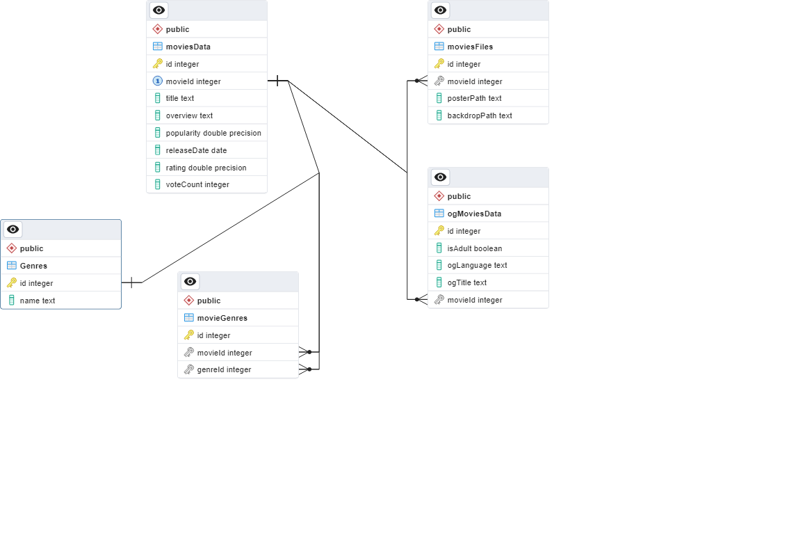
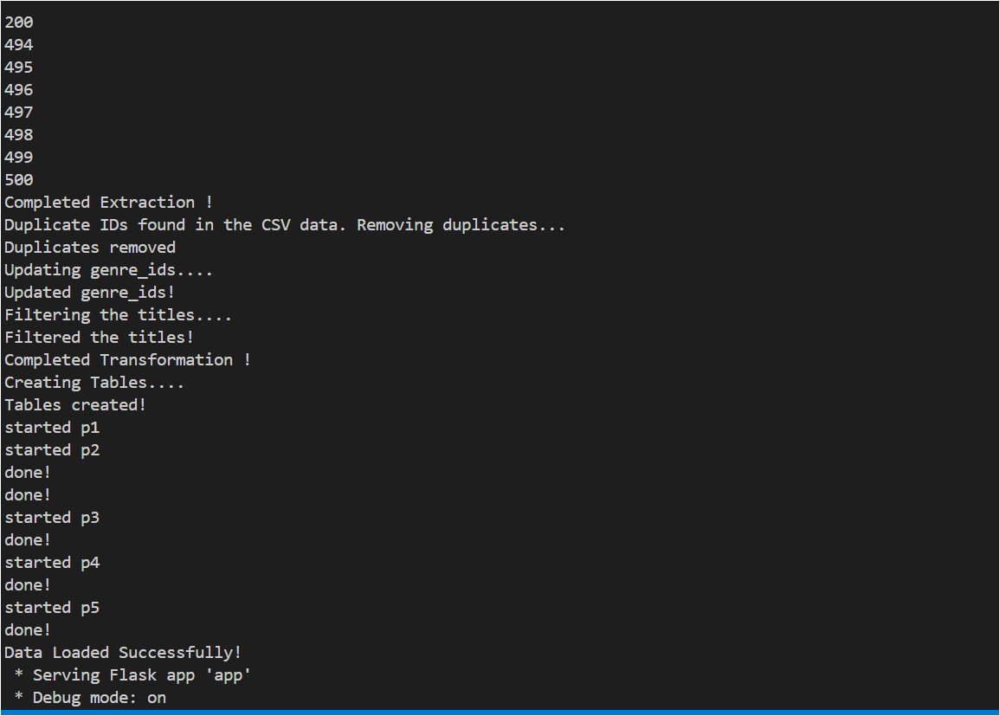
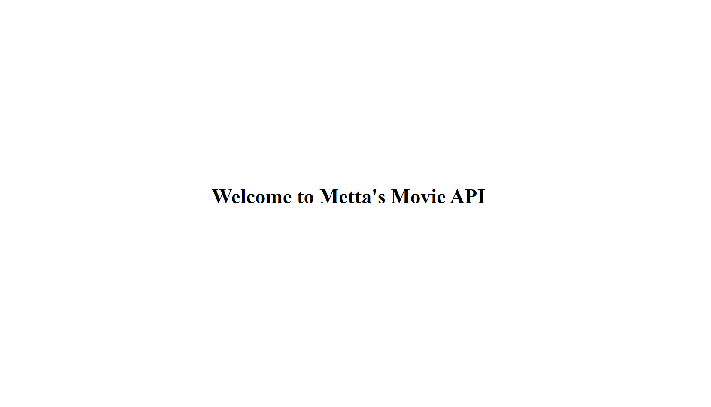
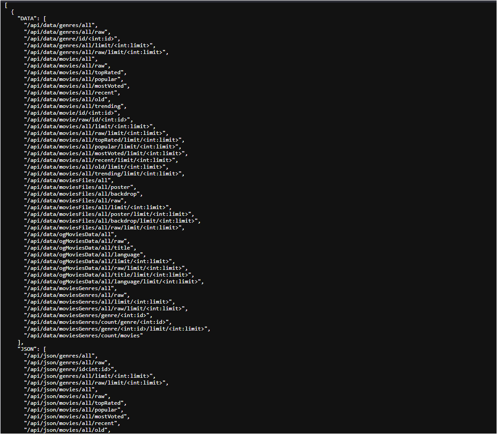
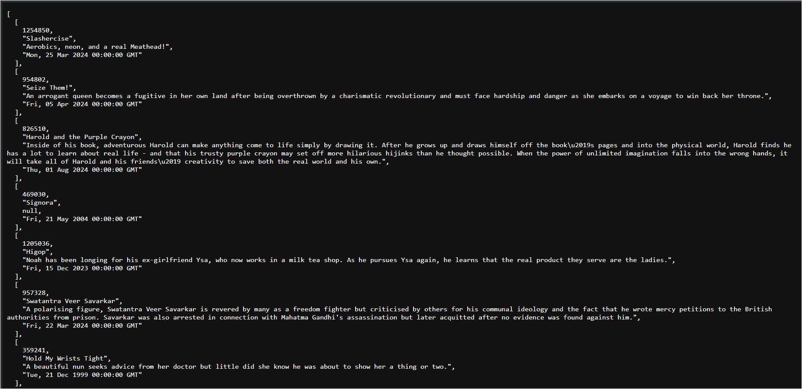
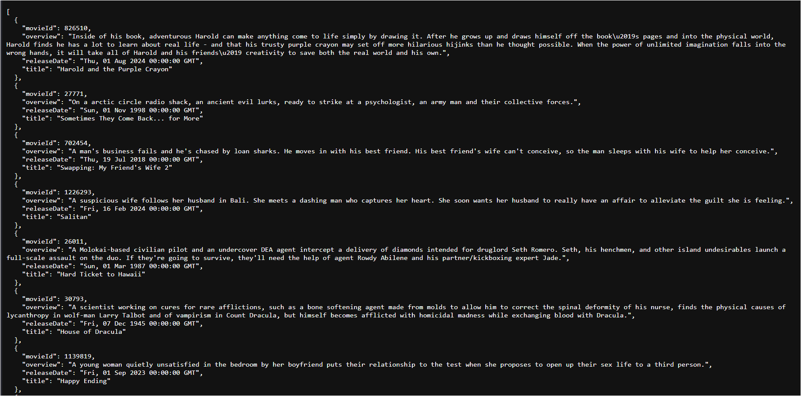

# Met-ELT-Project

## BRIEF DESCRIPTION:
Metta's Movie API is a Python-based project designed to extract movie data from an external API (TMDB), process and filter it, and then load it into a PostgreSQL database. It provides an API endpoint to access movie data and genres. The project utilizes Flask for the API server, PostgreSQL for database management, and Docker for containerization.

## TECHNOLOGIES USED:
- Python
- Flask
- PostgreSQL
- Docker

## SETUP INSTRUCTIONS:
1. **Clone the repository:**
   ```
   git clone git@github.com:MettaSurendhar/DataEngineeringProject.git
   ```

2. **Install dependencies:**
   ```
   pip install -r requirements.txt
   ```

3. **Set up PostgreSQL database using Docker:**
   ```
   docker-compose up -d
   ```

4. **Create a `.env` file and add the required environment variables:**
   ```
   API_KEY=<your_api_key>
   GENRE_LIST_API=<genre_list_api_endpoint>
   MOVIE_LIST_API=<movie_list_api_endpoint>
   DB_HOST=<database_host>
   DB_NAME=<database_name>
   DB_USER=<database_user>
   DB_PASSWORD=<database_password>
   DB_PORT=<database_port>
   ENGINE_PASSWORD=<engine_password>
   ```

5. **Run the Python scripts seperately to extract, filter, and load movie data into the database:**
   ```
   python dataExtraction.py
   python dataTransformation.py
   python dataLoad.py
   ```

6. **Run the Flask application to start the API server:**
   ```
   python app.py
   ```

7. **Instead can run the .sh file to extract, filter, and load data and run Flask app :**
   ```
   bash ./entryPoint.sh
   ```

## ER DIAGRAM:


## SCREENSHOTS OF OUTPUT:

### Terminal Output

### API Output : /api

### API Output : /api/all

### API Output : /api/data/movies/all/trending/limit/10

### API Output : /api/json/movies/all/trending/limit/10



## CONTRIBUTION GUIDE:
### Contributions to Met-ELT-Project are welcome! Follow these steps to contribute:
  1. Fork the repository.
  2. Create a new branch (`git checkout -b feature/your-feature-name`).
  3. Make your changes.
  4. Test your changes thoroughly.
  5. Commit your changes (`git commit -am 'Add new feature'`).
  6. Push to the branch (`git push origin feature/your-feature-name`).
  7. Create a new Pull Request.

## ADDITIONAL INFO:
- Ensure that the necessary environment variables are properly set up in the `.env` file for the project to function correctly.
- The project utilizes Docker for containerization, making it easy to set up the development environment.
- Review the `requirements.txt` file for all dependencies used in the project.
